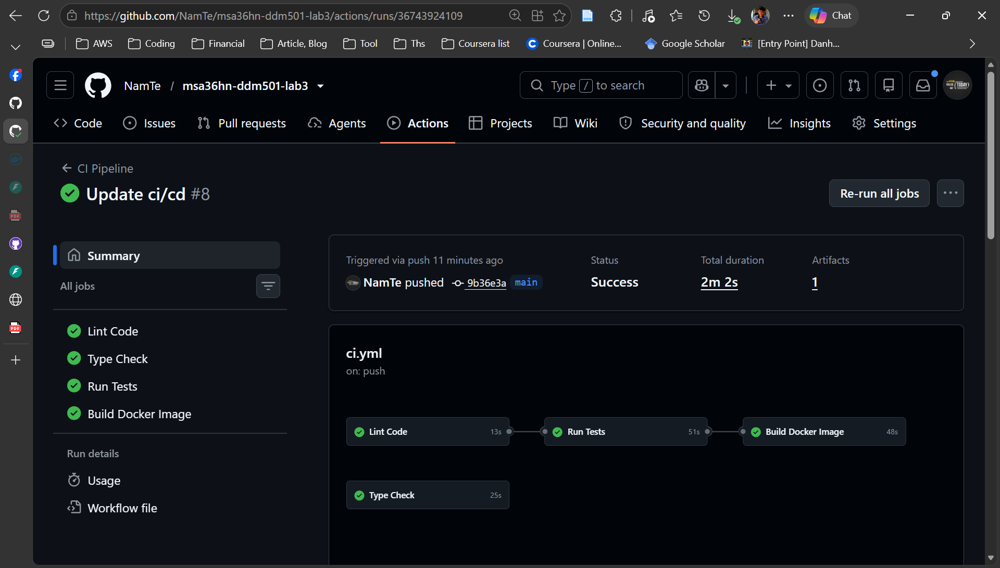
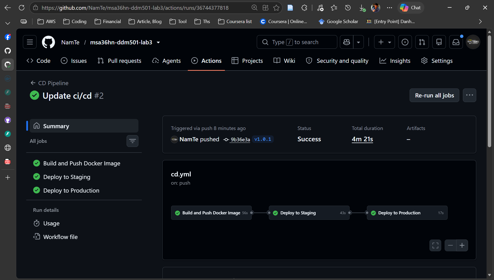
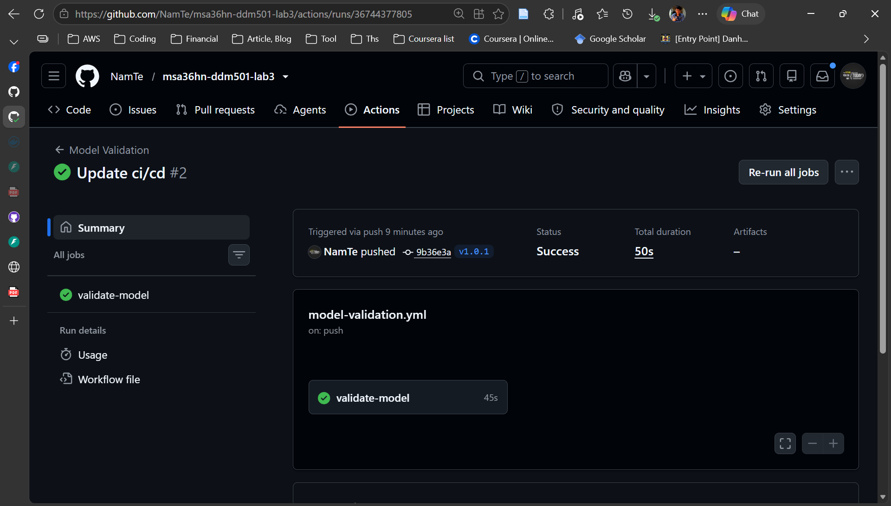
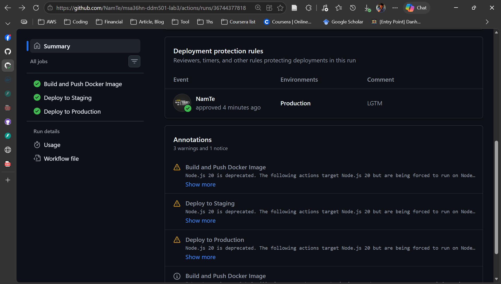
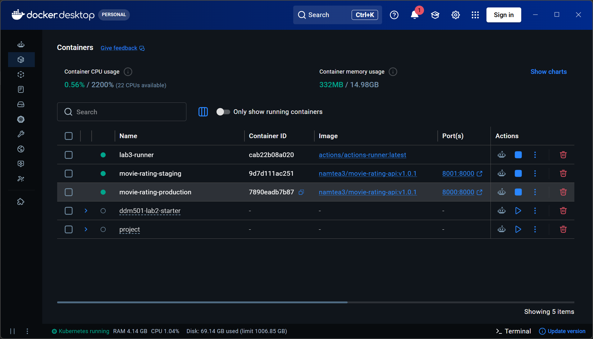
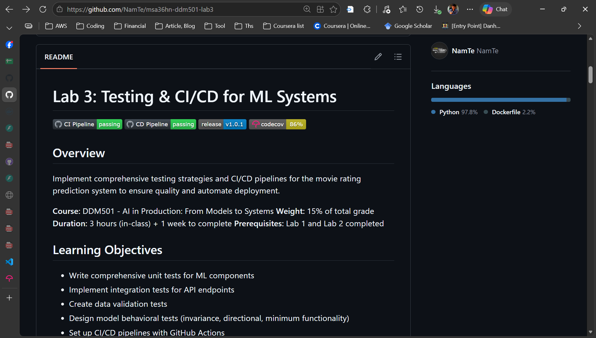
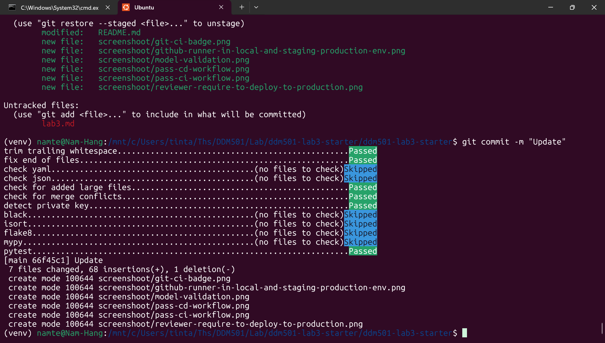

# Lab 3: Testing & CI/CD for ML Systems

[](https://github.com/NamTe/msa36hn-ddm501-lab3/actions/workflows/ci.yml)
[](https://github.com/NamTe/msa36hn-ddm501-lab3/actions/workflows/cd.yml)
[](https://github.com/NamTe/msa36hn-ddm501-lab3/releases/latest)

## Overview

Implement comprehensive testing strategies and CI/CD pipelines for the movie rating prediction system to ensure quality and automate deployment.

**Course:** DDM501 - AI in Production: From Models to Systems
**Weight:** 15% of total grade
**Duration:** 3 hours (in-class) + 1 week to complete
**Prerequisites:** Lab 1 and Lab 2 completed

## Learning Objectives

- Write comprehensive unit tests for ML components
- Implement integration tests for API endpoints
- Create data validation tests
- Design model behavioral tests (invariance, directional, minimum functionality)
- Set up CI/CD pipelines with GitHub Actions
- Implement automated code quality checks

## Project Structure

```
ddm501-lab3-starter/
├── app/
│   ├── __init__.py
│   ├── main.py             # FastAPI application
│   ├── model.py            # ML model class
│   ├── schemas.py          # Pydantic schemas
│   └── config.py           # Configuration
├── tests/
│   ├── __init__.py
│   ├── conftest.py         # Shared fixtures
│   ├── unit/
│   │   ├── __init__.py
│   │   ├── test_model.py   # Model unit tests (TODO)
│   │   └── test_schemas.py # Schema tests (TODO)
│   ├── integration/
│   │   ├── __init__.py
│   │   └── test_api.py     # API tests (TODO)
│   ├── data/
│   │   ├── __init__.py
│   │   └── test_data_quality.py  # Data tests (TODO)
│   └── model/
│       ├── __init__.py
│       └── test_model_behavior.py  # Behavioral tests (TODO)
├── .github/
│   └── workflows/
│       ├── ci.yml          # CI pipeline (TODO)
│       └── cd.yml          # CD pipeline (TODO)
├── scripts/
│   └── train_model.py      # Model training script
├── models/                 # Saved models
├── .pre-commit-config.yaml # Pre-commit hooks (TODO)
├── pyproject.toml          # Project configuration
├── requirements.txt
├── requirements-dev.txt    # Development dependencies
├── Dockerfile
└── README.md
```

## Quick Start

### 1. Clone and Setup

```bash
git clone https://github.com/[your-repo]/ddm501-lab3-starter.git
cd ddm501-lab3-starter

# Create virtual environment
python -m venv venv
source venv/bin/activate  # Linux/Mac

# Install dependencies
pip install -r requirements.txt
pip install -r requirements-dev.txt
```

### 2. Train Model (if not exists)

```bash
python scripts/train_model.py
```

### 3. Run Tests

```bash
# Run all tests
pytest tests/ -v

# Run with coverage
pytest tests/ -v --cov=app --cov-report=html

# Run specific test category
pytest tests/unit/ -v
pytest tests/integration/ -v
pytest tests/data/ -v
pytest tests/model/ -v
```

### 4. Code Quality Checks

```bash
# Install pre-commit hooks
pip install pre-commit
pre-commit install

# Run all checks manually
pre-commit run --all-files

# Individual tools
black app/ tests/
flake8 app/ tests/
mypy app/
```

### 5. Run the API

```bash
uvicorn app.main:app --reload --host 0.0.0.0 --port 8000
```

## TODO Tasks

Complete the following files:

### Test Files
- [ ] `tests/unit/test_model.py` - Unit tests for model class
- [ ] `tests/unit/test_schemas.py` - Schema validation tests
- [ ] `tests/integration/test_api.py` - API endpoint tests
- [ ] `tests/data/test_data_quality.py` - Data quality tests
- [ ] `tests/model/test_model_behavior.py` - Behavioral tests

### CI/CD Files
- [ ] `.github/workflows/ci.yml` - CI pipeline
- [ ] `.github/workflows/cd.yml` - CD pipeline (BONUS)
- [ ] `.pre-commit-config.yaml` - Pre-commit hooks

## Test Types

### Unit Tests
Test individual functions and classes in isolation.

```python
def test_model_loads_successfully(model):
    assert model.is_loaded()
```

### Integration Tests
Test component interactions and API endpoints.

```python
def test_predict_valid_request(test_client):
    response = test_client.post("/predict", json={"user_id": "196", "movie_id": "242"})
    assert response.status_code == 200
```

### Data Tests
Validate data quality and schema.

```python
def test_ratings_in_valid_range(sample_ratings):
    for r in sample_ratings:
        assert 1.0 <= r["rating"] <= 5.0
```

### Behavioral Tests
Test model behavior patterns.

```python
def test_same_input_same_output(model):
    result1 = model.predict("196", "242")
    result2 = model.predict("196", "242")
    assert result1 == result2
```

## CI/CD Pipeline

### Continuous Integration
- Runs on every push and pull request
- Executes linting, type checking, and tests
- Reports code coverage

### Continuous Deployment (BONUS)
- Triggered on version tags
- Builds and pushes Docker image
- Deploys to staging/production

## Execution Evidence

The screenshots below capture the completed workflows and local deployment.
The recorded CD run deployed tag **v1.0.1**. The badges above show live workflow
status and the latest published release; the release badge is not a live check
of the version running in each environment.

<details open>
<summary>Passing CI: linting, type checking, tests, and Docker build</summary>

All four CI jobs succeeded, and the run produced one artifact.



</details>

<details open>
<summary>Passing CD: image publishing and staging/production deployment (v1.0.1)</summary>

The release workflow successfully built and pushed the image, then deployed to
staging and production for tag `v1.0.1`.



</details>

<details open>
<summary>Passing model-validation workflow</summary>

The model-validation job completed successfully.



</details>

<details open>
<summary>Production deployment approval</summary>

The deployment protection record shows reviewer approval for the production
environment, with the comment `LGTM`.



</details>

<details open>
<summary>Self-hosted runner and deployed containers in Docker Desktop</summary>

Docker Desktop shows `lab3-runner`, `movie-rating-staging`, and
`movie-rating-production` running. Both application containers use the `v1.0.1`
image, with staging exposed on port `8001` and production on port `8000`.



</details>

<details open>
<summary>CI badge displayed in the repository README</summary>

The captured README displays the CI Pipeline badge with a passing status.



</details>

<details open>
<summary>Pre-commit hooks during a successful commit</summary>

The commit completed after the applicable standard hooks and pytest passed.
Black, isort, Flake8, mypy, and the YAML/JSON checks were skipped because no
matching files were staged in this commit.



</details>

## Grading Rubric

| Criteria | Weight |
|----------|--------|
| Test Coverage (unit, integration, data, model) | 30% |
| CI/CD Pipeline | 30% |
| Code Quality | 20% |
| Documentation | 20% |

**Minimum Requirements:**
- 80% code coverage
- All CI checks passing
- Pre-commit hooks configured

## Resources

- [pytest Documentation](https://docs.pytest.org/)
- [GitHub Actions](https://docs.github.com/en/actions)
- [pre-commit](https://pre-commit.com/)
- [Black](https://black.readthedocs.io/)
- [Flake8](https://flake8.pycqa.org/)
- [mypy](https://mypy.readthedocs.io/)

## Submission

1. Complete all TODO items
2. Ensure all tests pass
3. Achieve minimum 80% coverage
4. Push to GitHub with CI badge
5. Submit repository link via LMS

## License

MIT License - For educational purposes only.
